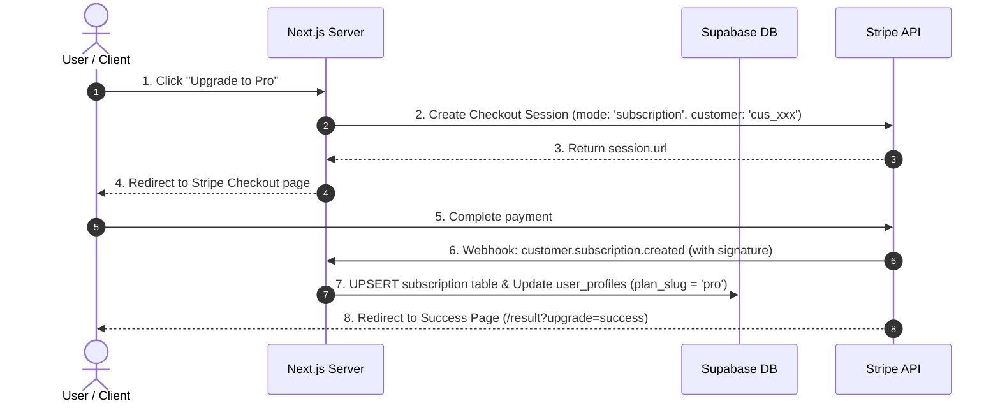

> [!WARNING]
> **Archived / Historical** — This document has been moved to archive/ and is no longer an active project reference. It is retained for historical context only. Do not use as instructions.

# Stripe Billing & Subscription Integration Decision

**Date:** 2026-05-24  
**Author:** Senior Billing Integration Engineer  
**Status:** **PROPOSED & DECIDED** (Awaiting Technical/Legal Sign-off)

---

## 1. Executive Summary

This document outlines the architectural and product decisions for integrating Stripe billing into the `PromptPolish` SaaS platform. It aligns Stripe Checkout, Stripe Customer Portal, Supabase Auth, and Vercel serverless functions into a robust, high-performance plan entitlement framework. 

To maintain clean engineering practices, **billing integration will not mix with product logic**. The application will enforce a strict, server-side plan entitlement layer that treats Stripe as an asynchronous state updater.

---

## 2. Core Architectural Decisions

### A. Subscription vs. Credits
*   **Decision:** **Monthly Subscription Model** for the Pro plan.
*   **Rationale:** Prompt optimization and workflow history are recurring value drivers. A subscription model secures predictable Monthly Recurring Revenue (MRR) and aligns naturally with the plan entitlement layer. Anonymous users will continue to have a daily abuse limit of 3 free audits (credit/rate-limiting), encouraging them to upgrade to a persistent subscription.
*   **Alternatives Considered:** One-off audit credit packages (e.g., $5 for 50 credits). Rejected due to higher friction, transactional unpredictability, and user anxiety over "wasting" credits on exploratory prompt testing.

### B. Monthly vs. Annual
*   **Decision:** **Monthly Billing Only** at launch ($9 to $12 USD / month).
*   **Rationale:** Minimizes Stripe catalog complexity (fewer Price IDs), eliminates complex prorations, and reduces refund/lifecycle edge cases. Annual billing will be deferred to a later iteration once the core SaaS unit economics are proven.
*   **Alternatives Considered:** Dual Monthly/Annual options. Rejected for launch to maximize velocity.

### C. Trial vs. No Trial
*   **Decision:** **No Free Trial** for the Pro subscription.
*   **Rationale:** The completely free, anonymous-first tier serves as a permanent, frictionless trial of the core utility. By the time a user registers and inputs credit card info, they are already convinced of the value. This eliminates credit card fraud, trial abuse, and the state-management complexity of `trialing` Stripe cycles.
*   **Alternatives Considered:** 7-day free trial with card required. Rejected due to checkout abandonment friction and high trial-abuse potential.

### D. Single Pro Plan vs. Multi-Tier Plans
*   **Decision:** **One Single Pro Plan** ("Pro").
*   **Rationale:** Standardizes database checking (`plan_slug` is strictly either `free` or `pro`), simplifies pricing page UX, and minimizes database schemas. 
*   **Alternatives Considered:** Pro, Team, and Enterprise tiers. Rejected; multi-member workspaces and advanced collaboration features are out of scope for the MVP stage.

### E. Currency
*   **Decision:** **USD ($)** as the primary base currency.
*   **Rationale:** Simplifies backend calculations and pricing layout. Stripe will handle automatic currency conversion at Checkout for international buyers. 

---

## 3. Legal, Tax, and Refund Policy Draft

> [!CAUTION]
> **LEGAL & TAX REVIEW REQUIRED**  
> The drafts and compliance questions below are proposed by engineering and **MUST** be reviewed and formally signed off by certified legal counsel and a tax advisor prior to accepting live production payments.

### A. Cancellation Policy
*   Users may cancel their Pro subscription instantly at any time via the self-service **Stripe Customer Portal**.
*   Upon cancellation, the subscription state changes to `cancel_at_period_end = true`. The user's Pro entitlements remain active until the end of the current billing cycle, at which point the profile is degraded back to `free`.

### B. Refund Policy Draft
*   We offer a **14-day money-back guarantee** ONLY if the user has consumed **fewer than 10 analyses** during that billing cycle.
*   If the user has processed 10 or more analyses, the purchase is strictly non-refundable. This protects PromptPolish from cost exploitation (e.g., auditing a large prompt backlog in 2 days and requesting a full refund) and covers external LLM (Gemini API) processing expenses.

### C. VAT & Tax Questions to Verify
1.  **Stripe Tax Activation:** Should we enable **Stripe Tax** to automate sales tax/VAT calculations? (Stripe Tax charges a small fee per transaction but removes massive operational overhead in the EU/US).
2.  **VAT OSS Registration:** If selling to European B2C customers, are we registered under the VAT One-Stop Shop (OSS) scheme, or are we operating under local tax-exemption thresholds?
3.  **B2B Reverse Charge:** How will we validate customer VAT/Tax IDs at checkout? Stripe Checkout can collect these natively, but we must verify reverse-charge compliance for B2B transactions.
4.  **Invoicing Requirements:** In Europe, invoices must contain sequential numbers, seller VAT ID, and buyer tax details. We must configure Stripe to automatically generate and email legally compliant PDF invoices.

---

## 4. Integration Specifications & Constraints



### A. Stripe API & Webhook Specifications
*   **Stripe SDK:** Use the server-only `stripe` npm library (`const stripe = require('stripe')(process.env.STRIPE_SECRET_KEY)`).
*   **Checkout Flow:** `/api/billing/checkout` will create a Stripe Checkout Session in `subscription` mode. If a logged-in user already has a `stripe_customer_id` stored in `stripe_customers`, it must be passed in the `customer` field to prevent duplicate customer profiles.
*   **Customer Portal:** `/api/billing/portal` will generate a Billing Portal Session for the user's `stripe_customer_id`, allowing safe billing management.
*   **Webhook Signature Verification:** Webhooks sent to `/api/webhooks/stripe` must verify the `stripe-signature` header against `process.env.STRIPE_WEBHOOK_SECRET` using:
    ```typescript
    const event = stripe.webhooks.constructEvent(
      rawBody,
      signature,
      process.env.STRIPE_WEBHOOK_SECRET
    );
    ```
*   **Webhook Idempotency:** The webhook handler must guard against duplicate events. It will track processed event IDs in a dedicated table or execute idempotent database operations (SQL `UPSERT` with strict constraint checking on `stripe_subscription_id`).
*   **Key Webhook Events to Monitor:**
    *   `customer.subscription.created` / `customer.subscription.updated`: Sync active subscription state, set `plan_slug = 'pro'`.
    *   `customer.subscription.deleted`: Set user's `plan_slug = 'free'`.
    *   `invoice.payment_succeeded`: Log telemetry, confirm account is in good standing.
    *   `invoice.payment_failed`: Log event, trigger grace-period warnings or degrade plan if unpaid.

### B. Supabase Auth Integration Constraints
*   **Account Dependency:** Stripe Checkout and Customer Portal require an authenticated `user_id`. Users **must** create an account before initiating checkout.
*   **Anonymous History Migration:** When a user registers, the frontend must capture their local `owner_anonymous_id` cookie and call `/api/auth/link-anonymous` to bulk-update existing `prompt_analyses` records from `owner_anonymous_id` to their new `user_id`.
*   **Database Schema & RLS:**
    *   Create `stripe_customers` linking `user_id` (PK references `auth.users(id)`) to `stripe_customer_id`.
    *   Create `subscriptions` containing subscription status, period bounds, and price identifiers.
    *   **RLS Rule:** Enable Row-Level Security on both tables. Users have read-only access to their own rows (`auth.uid() = user_id`). No insert, update, or delete privileges are granted to client connections. All writes must occur via Stripe Webhooks or server-side Checkout APIs using the elevated `getSupabaseAdminClient()`.

### C. Vercel Webhook & Runtime Constraints
*   **Execution Time Limit:** Webhooks must respond with `200 OK` within **3 seconds** to avoid Stripe retrying the event. While Vercel functions support up to 15 seconds, the webhook handler should immediately parse, write to Supabase, and return a response. Long tasks (like sending emails) should be deferred.
*   **Raw Request Body:** signature verification requires the raw request body buffer. Next.js Route Handlers parse request bodies automatically if `.json()` is called. To obtain the raw body, we must read the body as text first:
    ```typescript
    const rawBody = await req.text();
    ```
*   **Payload Size Limit:** Vercel has a 4.5 MB request size limit. Stripe webhook payloads are tiny (<10 KB), meaning this limit presents zero risk.

---

## 5. Security & Key Safeguards

1.  **Zero Client Secrets:** The `STRIPE_SECRET_KEY` and `STRIPE_WEBHOOK_SECRET` must **never** be prefixed with `NEXT_PUBLIC_` or references made in client bundles.
2.  **Static Leak Detection:** Ensure the Vitest bundle checks in `tests/security/client-exposure-checks.test.ts` are updated to scan for references to "STRIPE" or "stripe" secrets inside client-side page bundles.
3.  **Server-Side Entitlement Enforcements:** The client UI (pricing tables, Pro badges, and limits UX) is strictly cosmetic. The backend routes (`/api/analyze` and export handlers) must directly query the database to verify the user's active `plan_slug` and remaining usage limits before performing actions.

---

## 6. Blocking Unknowns & Risks

The following items are unresolved dependencies that block the active writing of billing code:

| # | Unknown / Risk | Impact | Action Required |
|:-:| :--- | :--- | :--- |
| **1** | **Unapplied Database Migrations** | Remote database has no tables (`prompt_analyses`, `usage_events`, etc.). | Run `supabase/migrations/` files against remote Supabase. |
| **2** | **No Live Environment Credentials** | MVP is currently locked in mock-result mode. We cannot verify real API costs or usage patterns. | Provision live Gemini API keys, Supabase credentials, and cookie secrets in Vercel. |
| **3** | **Absence of Supabase Auth** | The application is currently 100% anonymous. We cannot map Stripe customers to users. | Complete Stage 1 of the roadmap (Supabase Auth and User Profile foundation). |
| **4** | **Unconfirmed Legal Drafts** | Privacy Policy and Terms of Service are placeholders, exposing the merchant to compliance risks in the EU. | Perform formal legal review, remove draft warnings, and execute sub-processor DPAs. |
| **5** | **No Stripe Test Mode Keys** | We lack Stripe test API keys for local developer environments. | Create a dedicated Stripe developer account and map test keys to `.env.local`. |

---

## 7. Next Steps & Phase Roadmap

We will adhere strictly to the product safety guardrails. **No billing code will be written in the current phase**. 

```text
               [ Current Stage ]
        Prepare Billing Decision Document
                       │
                       â–Ľ
          [ Phase A: MVP Quality Closure ]
         Resolve TypeScript & Lint Debt
                       │
                       â–Ľ
         [ Phase B: Staging Phase 2 Auth ]
        Setup Supabase Auth & Accounts (Stage 1)
                       │
                       â–Ľ
          [ Phase C: Stripe Billing ]
         Implement Webhooks & Checkout (Stage 6)
```
