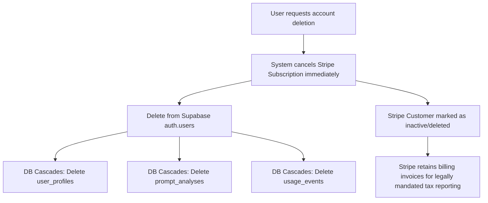

> [!WARNING]
> **Archived / Historical** — This document has been moved to rchive/ and is no longer an active project reference. It is retained for historical context only. Do not use as instructions.

# Data Deletion Request Flow (Draft)

> [!WARNING]
> **LEGAL & TECHNICAL REVIEW REQUIRED**  
> This data deletion flow document is a technical and legal draft prepared for the PromptPolish SaaS platform to map compliance with GDPR Article 17 (Right to Erasure / "Right to Be Forgotten"). It does **not** guarantee regulatory compliance and **must** be reviewed and approved by qualified legal counsel and security engineers before public launch. **Do not deploy paid production features or declare GDPR compliance before this review is complete.**

---

## 1. Overview & Data Minimization Philosophy

PromptPolish is designed with a **privacy-by-design** and data minimization approach:
*   **Anonymous Users:** We do not collect names, email addresses, or persistent personal identifiers. The relation between a user's browser and their generated reports is maintained strictly via an essential, localized browser cookie (`owner_anonymous_id`).
*   **Registered / Pro Users:** When users register for the Pro Plan, we store their email address, account ID, and subscription billing status.

Because data is stored, users have the legal right to request the complete erasure of all personal or pseudonymous data associated with them. This document outlines the self-service and manual deletion mechanisms.

---

## 2. Deletion Flow: Anonymous Users

Since anonymous users have no associated account profile or email, their deletion flow is entirely cookie-based and self-service.

### A. Self-Service Deletion via "Delete History"
*   **Action:** The user clicks the **"Clear History"** or **"Delete History"** button in their local dashboard.
*   **Request:** The browser sends a `POST` request to `/api/clear-history` (or `/api/history/clear`) carrying the `owner_anonymous_id` cookie.
*   **Backend Purge:** The backend performs a hard delete (`DELETE`) on all rows in the `prompt_analyses` table matching the verified `owner_anonymous_id`.
*   **Cookie Erasure:** The server responds by setting the `owner_anonymous_id` cookie's expiration date in the past, causing the browser to delete the cookie immediately.

### B. Self-Service Deletion via Cookie Clearing
*   **Action:** The user clears their browser cache or deletes their cookies.
*   **Result:** The browser deletes the `owner_anonymous_id` cookie.
*   **Pseudonymity Disassociation:** The user is permanently and irreversibly disassociated from their past reports on our server. The server no longer has any method to identify which IP hash or browser generated those specific database rows.
*   **Scheduled Cleanup:** Orphaned anonymous reports are automatically hard-deleted from the Supabase database after **30 days** by the automated database retention script (`db/cleanup-scheduler` or similar dry-run routines).

---

## 3. Deletion Flow: Registered / Pro Users (Cascading Account Purge)

When a registered Pro subscriber requests the deletion of their account, the deletion must cascade across all databases, sub-processors, and third-party systems.

### Step 1: Initiating Deletion
*   The user accesses their Account Settings and clicks **"Permanently Delete Account"**.
*   The UI displays a clear confirmation modal, warning that this action is **permanent, non-reversible, and will immediately terminate their Pro subscription without a refund for the remaining days**.

### Step 2: Stripe Billing Synchronization
*   The backend calls the Stripe API to **cancel any active subscription immediately** (`stripe.subscriptions.cancel(sub_id)`).
*   *Note on Stripe Customer Record:* We do **not** delete the Stripe Customer profile (`stripe.customers.delete(cus_id)`) because tax and accounting regulations in the US/EU require merchants to retain invoice records for 5 to 7 years. However, we disassociate the customer from our active product database.

### Step 3: Cascading Database Purge
*   The backend issues a secure delete command on `auth.users` for the matching `user_id` using the Supabase Admin Client.
*   Our database schema implements `ON DELETE CASCADE` foreign key constraints:
    *   Deleting the user row automatically cascades to delete the corresponding profile in `user_profiles`.
    *   All prompt analyses (`prompt_analyses`) associated with that `user_id` are hard-deleted.
    *   All telemetry logs (`usage_events`) associated with that `user_id` are hard-deleted.

### Step 4: Downstream Sub-processor Verification
*   **Google Gemini API:** Because Google Gemini API processes prompt payloads strictly in-memory (in-flight) and does not persist prompt logs, there is no downstream payload data to request deletion for from Google.

---

## 4. Manual Deletion Requests

If a user cannot access their account or has cleared their cookies but still wants to ensure their data is deleted (e.g., by providing a specific report ID or share token):
*   Users can email a request to **support@promptpolish.com** with the subject "GDPR Data Erasure Request".
*   The support team will manually verify ownership of the data (e.g., by requesting the user verify the exact prompt content or share link token) and execute a backend script to purge the records within the legally required 30-day GDPR response window.

---

## 5. Unresolved GDPR & Legal Questions

The following operational and legal questions must be evaluated by counsel before public release:

1.  **Stripe Invoicing Retention vs. GDPR Deletion:**
    *   *Question:* Under GDPR, the right to erasure can be overridden by a legal obligation to retain data (such as tax/accounting law). Does our retention of customer names/emails on Stripe invoices for tax auditing comply with GDPR Art. 17(3)(b)?
    *   *Impact:* We must ensure our Privacy Policy explicitly states that billing transaction logs are retained for tax/accounting purposes under legal obligation, despite account deletion.
2.  **IP Telemetry Log Retention:**
    *   *Question:* Are raw network logs on Vercel or database telemetry logs fully purged within our 90-day telemetry retention window?
    *   *Impact:* If Vercel logs store raw IP addresses alongside route accesses, we must configure log-drain filters to mask the final octets of IP addresses or reduce log retention to under 30 days.
3.  **Backup Restoration Restoration Window:**
    *   *Question:* If we restore our Supabase database from a backup, deleted users might temporarily reappear. How do we prevent this?
    *   *Impact:* We must establish an operational policy that if a database backup is restored, we cross-reference a transaction log of deletions to re-purge any users who requested deletion between the backup timestamp and the restoration timestamp.
