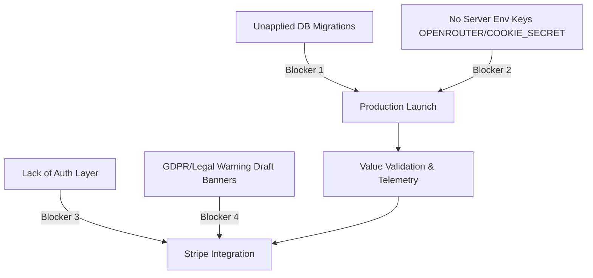

> [!WARNING]
> **Archived / Historical** — This document has been moved to rchive/ and is no longer an active project reference. It is retained for historical context only. Do not use as instructions.

# Paid SaaS Readiness Report — PromptPolish

**Date:** 2026-05-23  
**Author:** Senior SaaS Product & Integration Engineer  
**Status:** **NO-GO FOR PAID ROADMAP** (Recommend launching the Anonymous MVP first)  

---

## 1. Executive Summary & Verdict

This report evaluates whether the PromptPolish application is technically, operationally, and commercially ready to transition from its anonymous-first MVP stage to the paid SaaS roadmap.

### đź”´ Verdict: **NO-GO** (Immediate Action: Launch & Validate MVP)

While the PromptPolish codebase is exceptionally secure and fully meets all production-readiness criteria, **initiating auth, billing, or pricing implementation is premature**. We must adhere to the project's absolute rule:  
> [!IMPORTANT]
> **Core Roadmap Principle**: *Do not add auth, billing, pricing, or Stripe before validating the core MVP value with real users.*

### Summary of Recommended Strategy
We recommend the **"continue MVP"** pathway. The application is a beautifully designed, highly secure, and well-calibrated utility. However, the database tables are not yet initialized on the hosted production Supabase, no live API keys are active in the production environment, and we have zero actual user value signals. The immediate focus must be launching the anonymous tool, enabling live OpenRouter execution, and gathering the initial cohort of telemetry to prove repeat usage and commercial demand.

---

## 2. MVP Telemetry & Usage Metrics

To transition to a paid SaaS model, we require concrete data points showing that users find the core tool valuable. The table below outlines the current metrics.

> [!NOTE]
> **Pre-Launch Status**: Because the database migrations have not yet been applied to the hosted production Supabase project (`uddpuxpdoctgaqabenol.supabase.co`), and the system is running under mock analysis mode (`NEXT_PUBLIC_ENABLE_MOCK_RESULT=true`) during development, **all active user telemetry is currently recorded as UNKNOWN / 0**. 

| Telemetry Metric | Current Value | Target Gate for Paid SaaS | Source / Diagnostic Notes |
| :--- | :---: | :---: | :--- |
| **Number of Analyses** | **UNKNOWN (0)** | 50–100 real audits | Requires applying migrations and activating live API keys. |
| **Form Completion Rate** | **UNKNOWN** | > 45% | Ratio of landing impressions vs. successful submissions. |
| **Copy Rate (`copy_improved_prompt`)** | **UNKNOWN (0)** | > 30% | The primary signal of utility—users copying the improved prompt. |
| **Feedback Rating (Up/Down)** | **UNKNOWN (0)** | > 80% positive upvotes | User-reported satisfaction with the quality of diagnostics. |
| **Returning Users** | **UNKNOWN (0)** | 5–10 multi-session users | Cookie-linked repeat visits within a 14-day window. |
| **Share Usage (`share_link_created`)** | **UNKNOWN (0)** | > 10% of analyses | Percentage of users opting-in to create public shared URLs. |
| **Limit Reached Events** | **UNKNOWN (0)** | Tracked for limit resizing | Users hitting the daily limit of 3 analyses per IP/session. |
| **Estimated Analysis Cost** | **UNKNOWN** *(Calculated)* | Safe margins (< $0.001/audit) | Estimated at **~$0.000315 USD** per single-turn run (historical Gemini benchmark, see below). |
| **Token Usage (Prompt/Completion)** | **UNKNOWN (0)** | Clean, bounded outputs | Standard model input: ~600 tokens; output: ~900 tokens. |
| **Provider Errors** | **UNKNOWN (0)** | < 1% error rate | Tracks API timeouts, quota exhaustion, or server issues. |
| **Retry Count** | **UNKNOWN (0)** | For diagnostics only | Captures transient API failures recovered by backoff logic. |
| **Invalid Schema Count** | **UNKNOWN (0)** | **0%** (Strict Zod schema) | Tracks how often the model provider fails structured Zod validation. |

### Historical Cost & Token Benchmarks (Gemini 1.5 Flash)
Using the live token cost formula for **Gemini 1.5 Flash** (or `gemini-3.5-flash`):
$$\text{Cost per Analysis} = (\text{Input Tokens} \times \$0.000000075) + (\text{Completion Tokens} \times \$0.000000300)$$
*   **Typical Single-Turn Input**: ~600 tokens ($0.000045)
*   **Typical Single-Turn Output**: ~900 tokens ($0.000270)
*   **Total Estimated Cost per Run**: **~$0.000315 USD** (Highly sustainable for a free tier with a 3-audit daily ceiling).

---

## 3. Security & Quality Gate Verification

Before transitioning, the MVP must pass rigorous technical checklist gates. We have audited the codebase and confirm that **all 5 major security and quality checkpoints are 100% complete and validated**.

| Quality Gate | Status | Codebase Verification |
| :--- | :---: | :--- |
| **1. Share Disable Link** | **COMPLETE** | Supported by `disableShareLink` in `lib/supabase/queries.ts` and the `/api/share/disable` route handler. It utilizes strict server-side owner-anonymous cookie validation. Disabling immediately revokes the high-entropy token and returns a 404. Verified by [**`tests/api/share-disable.test.ts`**](file:///d:/AI/promptpolish/tests/api/share-disable.test.ts). |
| **2. Data Retention Cleanup** | **COMPLETE** | Fully implemented in `lib/privacy/retention.ts` with distinct retention periods (30 days for analyses, 90 days for events, 180 days for feedback). Explicitly exempts active shared records (`is_share_enabled = true`) to prevent broken public links. Tested via `scripts/retention-cleanup.ts` with dry-run capabilities. Verified by [**`tests/privacy/retention.test.ts`**](file:///d:/AI/promptpolish/tests/privacy/retention.test.ts). |
| **3. Bundle Leak Test** | **COMPLETE** | Enforced by a static check suite inside [**`tests/security/client-exposure-checks.test.ts`**](file:///d:/AI/promptpolish/tests/security/client-exposure-checks.test.ts). The check recursively scans all components and client pages to guarantee zero references to administrative secret keys, server-only database connection libraries, or the private `prompt_analyses` schema. |
| **4. Share Privacy Tests** | **COMPLETE** | Fully implemented and verified in [**`tests/supabase/share-privacy.test.ts`**](file:///d:/AI/promptpolish/tests/supabase/share-privacy.test.ts). The data access layer enforces a strict column-whitelist on public queries, completely redacting the creator's IP hash, internal UUIDs, cookie keys, and optional custom metadata before outputting the payload. |
| **5. Full-Schema Evaluation Diagnostic Suite** | **COMPLETE** | Structured in [**`scripts/run-evaluation.ts`**](file:///d:/AI/promptpolish/scripts/run-evaluation.ts). It validates 46 calibration scenarios (Polish and English inputs) using the live production schemas. |

---

## 4. The Pro SaaS Value Proposition

Based on the core product specifications and user friction points, we have identified the most likely **Pro Plan ($9–$15/month)** value proposition. Rather than charging for raw prompt audits alone, the paid tier should package the following workflows:

1.  **Persistent History & Searchable Library**:
    *   *Problem:* Free anonymous users lose all audits when they clear their browser cookies.
    *   *Value:* A personal dashboard with secure cloud history, favoriting, tagging, and advanced searching of their prompt collection.
2.  **Professional Export Suite**:
    *   *Problem:* Standard users can only copy the improved prompt text.
    *   *Value:* Multi-format export (beautifully formatted Markdown docs, structured PDF audit reports with custom branding) that copywriters can send directly to their clients or engineering teams.
3.  **Heavy-Duty Quota Expansion**:
    *   *Problem:* The free daily quota limits users to 3 analyses per day to prevent system abuse.
    *   *Value:* High-volume monthly allowances (e.g., 500 audits/month) and increased input limits (e.g., up to 24,000 characters).
4.  **Task Templates & Prompt Structuring Recipes**:
    *   *Problem:* Free-form inputs require heavy trial-and-error.
    *   *Value:* A database of pre-built prompt goals (e.g., "e-commerce copywriting", "refactoring script", "summarization agent") to instantly prep the audit pipeline.

---

## 5. Stripe Integration Blocking Risks

Before we begin writing code for billing, pricing tables, or Stripe webhooks, we must resolve these critical technical and legal blockers:



### 1. Database Table Initialization (Technical Blocker)
*   **Risk:** The production hosted Supabase instance does not contain the tables `prompt_analyses`, `usage_events`, or `feedback_events` in its active schema cache.
*   **Impact:** Any attempt to perform server-side writes in production will crash.
*   **Mitigation:** Run the baseline and corrective migrations (`supabase/migrations/`) and seed files against the remote Supabase database.

### 2. Unconfigured Production Credentials (Technical Blocker)
*   **Risk:** Production environment variables for `OPENROUTER_API_KEY`, `SUPABASE_SECRET_KEY`, and `COOKIE_SIGNING_SECRET` are currently unmapped or blank.
*   **Impact:** The system will fail safe by refusing to process audits and rejecting user result reads.
*   **Mitigation:** Generate cryptographically secure keys and map them directly inside the Vercel deployment dashboard before going live.

### 3. Lack of User Authentication (Architectural Blocker)
*   **Risk:** The MVP is completely anonymous, resolving owners strictly through cookies. Stripe billing requires a persistent `user_id` to link subscriptions, handle card cancellations, and manage upgrade/downgrade entitlements.
*   **Impact:** You cannot securely restrict Pro features or map Stripe webhook customer updates without an authentication database.
*   **Mitigation:** Implement Supabase Auth (Stage 1 of the roadmap) to establish persistent user accounts *prior* to billing code.

### 4. Legal Compliance & Draft Policy Banners (Legal Blocker)
*   **Risk:** Privacy Policy and Terms of Service documents in `/privacy` and `/terms` are currently marked with warning drafts, requiring professional legal review.
*   **Impact:** Operating a paid merchant subscription in the EU or UK with draft/placeholder legal agreements exposes the business to regulatory GDPR audits and customer chargeback disputes.
*   **Mitigation:** Have a certified legal consultant review and finalize policies, scrub all draft banners, and sign sub-processing agreements with the LLM providers before accepting credit card payments.

---

## 6. Recommended Pathway & Action Plan

Based on these findings, we recommend the **"continue MVP"** pathway, keeping the paid SaaS roadmap as a deferred milestone.

```text
========================================================================================
                                     IMMEDIATE PATHWAY
========================================================================================
   1. Initialize Hosted DB   ──>   2. Configure Prod Env   ──>   3. Launch Anonymous MVP
   (Apply SQL Migrations)        (Vercel Keys & Secrets)         (Gather Value Signals)
                                                                            │
   5. Build Billing foundation  <──  4. Add Auth & History <──  Prove Demand & Usage
    (Entitlements & Stripe)        (Transition to Accounts)       (50-100 real audits)
========================================================================================
```

### Action Checklist
- [ ] **Apply Migrations**: Connect to the remote hosted Supabase and run all migrations in `supabase/migrations/` and the seed file `supabase/seed.sql` to initialize the tables.
- [ ] **Deploy Env Variables**: Add secure credentials for the OpenRouter API, admin Supabase, cron secrets, and cookie signing in Vercel.
- [ ] **Launch Free MVP**: Turn off mock result mode (`NEXT_PUBLIC_ENABLE_MOCK_RESULT=false`) and deploy the app to public beta testers.
- [ ] **Gather Telemetry**: Monitor the Supabase SQL editor using our dashboard queries to track form completion, copy rate (>30%), and repeat visits.
- [ ] **Auth & Account Transition (Stage 1 & 2)**: Once demand is proven, integrate Supabase Auth so users can sign up to preserve their prompt history.
- [ ] **Stripe Foundation (Stage 3 & 6)**: Build out the plan entitlement checks and integrate Stripe checkout sessions.
