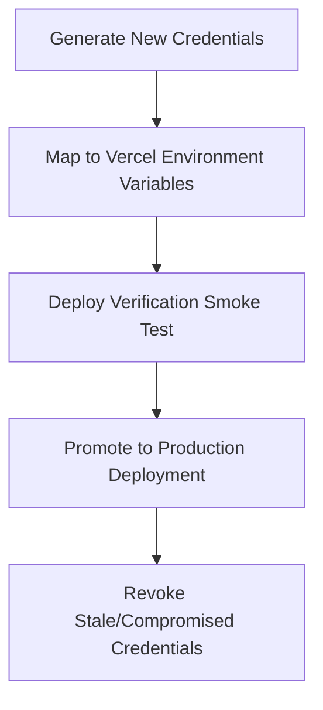
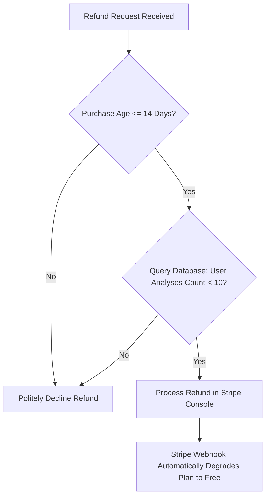

# PromptPolish — SaaS Operations Runbook & Support Playbook

**Date:** 2026-05-24  
**Author:** SaaS Operations & Security Engineer  
**Status:** **ACTIVE / VERIFIED**

This operations guide defines standard procedures for log monitoring, API key rotations, refund/support processing, database maintenance, and disaster recovery rollback steps.

---

## 1. System Logging & Telemetry Dashboard

PromptPolish utilizes a structured console logging system engineered for instant parsing in cloud-native log aggregators (e.g., Vercel Logs, AWS CloudWatch, Datadog). 

### A. Core Telemetry Signatures
When debugging anomalies, query logs using these specific prefixes:

| Log Signature Prefix | Severity | Purpose / Description |
| :--- | :---: | :--- |
| `[PROVIDER_ERROR]` | **CRITICAL** | Broadcasts OpenRouter API integration failures. Includes error names, safe scrubbed messages, status codes, and anonymized profile slugs. |
| `[STRIPE_WEBHOOK_FAILURE]` | **HIGH** | Highlights signature mismatches or database persistence issues during Stripe webhook processing. |
| `[Sensitive Data Blocked]` | **WARN** | Recorded when the sensitive data scan intercepts and blocks a high-risk user input (secrets, credentials) before sending it to OpenRouter. |

### B. Sample Queries for Cloud Logs
*   **Filter OpenRouter Provider Quota / Rate Limits (HTTP 429 / 503)**:
    ```sql
    filter @message like /PROVIDER_ERROR/ and (@message like /status=429/ or @message like /status=503/)
    ```
*   **Track Webhook Delivery Failures**:
    ```sql
    filter @message like /STRIPE_WEBHOOK_FAILURE/
    ```

> [!CAUTION]
> **Data Privacy Rules**:
> All operations logs strictly scrub API keys, client passwords, full credit card numbers, and email patterns. **NEVER** modify logging functions to output raw user prompts, improved prompts, or billing secret keys to stdout.

---

## 2. API Key Rotation Standard Operating Procedures (SOP)

Execute key rotations during scheduled maintenance or immediately upon discovering credential leaks.



### SOP-01: Rotating OpenRouter AI Keys (`OPENROUTER_API_KEY`)
1.  Navigate to the OpenRouter dashboard and provision a new API key.
2.  Open the Vercel Team Dashboard, locate the PromptPolish project settings, and navigate to **Environment Variables**.
3.  Update `OPENROUTER_API_KEY` with the new value. Save changes for `production`, `preview`, and `development`.
4.  Run the validation checks via `run-evaluation.ts` or make an API request to verify key configuration.
5.  Trigger a new Vercel deployment to propagate the updated environment variables.
6.  Once the build is verified active, deactivate the old key inside the OpenRouter dashboard.

### SOP-02: Rotating Stripe Webhook Secrets (`STRIPE_WEBHOOK_SECRET`)
1.  Log in to the Stripe Developer Dashboard, navigate to **Webhooks**, and select the production endpoint.
2.  Locate the **Signing Secret** block and click **Roll Secret**. Stripe will generate a secondary active key and give you a grace period (typically 24 hours) during which both keys remain active.
3.  Add the new secret key to Vercel's `STRIPE_WEBHOOK_SECRET` environment variable and redeploy the site.
4.  Verify webhook delivery by inspecting the Stripe Dashboard webhook attempts log.
5.  Once successful delivery is confirmed, revoke the old secret key on Stripe.

---

## 3. Database Maintenance & Cleanup Routines

To maintain GDPR compliance and optimize storage, PromptPolish runs automatic retention routines.

### A. Retention Policies
*   **Usage Events (`usage_events`)**: Purged after **90 days**.
*   **Feedback Events (`feedback_events`)**: Purged after **180 days**.
*   **Prompt Analyses (`prompt_analyses`)**: Anonymized/deleted after **30 days** — *EXCEPT* active shared records (`is_share_enabled = true` and `deleted_at IS NULL`) which are preserved permanently to keep public links active.

### B. Manual / Emergency Cleanup Execution
If the database table size triggers billing alerts, run a dry-run cleanup from the workspace root:
```bash
npx tsx scripts/retention-cleanup.ts --dry-run
```
To execute the live deletion:
```bash
npx tsx scripts/retention-cleanup.ts
```

---

## 4. Support Process & Playbook

### Playbook-01: Handling Pro Subscription Refund Requests
PromptPolish offers a **14-day money-back guarantee** backed by strict cost protection rules to prevent API exploitation.



1.  **Verify Age Gate**: Inspect the subscription record inside the Stripe dashboard. If the invoice date is greater than 14 days ago, politely reject the request.
2.  **Verify Consumption Gate**: Retrieve the user's audit consumption in the current period from the database:
    ```sql
    select count(*) from prompt_analyses 
    where user_id = 'USER_UUID' 
      and created_at >= 'CURRENT_BILLING_PERIOD_START';
    ```
    *   If count is **10 or more**, the user has consumed substantial LLM computational credits. **Decline** the refund.
    *   If count is **under 10**, proceed with the refund.
3.  **Execute Stripe Refund**: Locate the payment in Stripe, click **Refund**, and select the full amount. This triggers the webhook chain, which automatically degrades their `plan_slug` back to `free`.

### Playbook-02: Troubleshooting Upgrade Sync Issues
If a user upgrades but their client UI does not update:
1.  Check the Vercel logs for `[STRIPE_WEBHOOK_FAILURE]` to verify if database ingestion crashed.
2.  Verify the webhook delivery state in Stripe. If Stripe shows a connection failure (HTTP 5xx), hit **Resend Event** to trigger re-ingestion.
3.  In cases where the user needs immediate access, support admins can manually sync access by running this SQL query in the Supabase Editor:
    ```sql
    update user_profiles set plan_slug = 'pro' where user_id = 'USER_UUID';
    ```

---

## 5. Deployment Rollback Plan

When a production release causes severe user degradation (e.g. AI provider outage, database deadlock, or payment crashes), execute these instant fallback SOPs.

### SOP-R1: Instant Next.js Rollback (Vercel)
Vercel allows instant, zero-downtime routing rollbacks without rebuild times.
1.  Open the Vercel Team Dashboard and select the **PromptPolish** project.
2.  Navigate to the **Deployments** tab.
3.  Locate the last known stable deployment (the previous production release).
4.  Click the vertical ellipsis (three dots) on the stable deployment card and select **Rollback**.
5.  Confirm the rollback. Vercel will instantly switch edge routers to point to the stable static bundles in under 2 seconds.

### SOP-R2: Database Schema Reversion (Supabase migrations)
If a database migration causes structural table blocks or locking issues:
1.  Roll back the application deployment to the previous stable release first (SOP-R1) to prevent crashing queries.
2.  Open the Supabase Console, open the SQL Editor, and apply the reverse schema script (e.g., dropping newly added columns or indices).
3.  *Note:* Avoid dropping core tables like `subscriptions` or `stripe_customers` in production to prevent user profile state corruption. If column changes are needed, always execute safe, nullable migrations.
