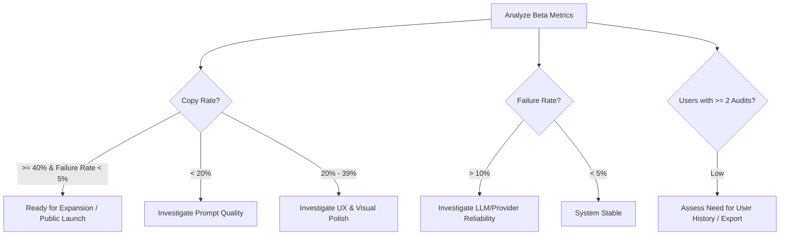

# Private Beta Monitoring & Decision Framework

This document outlines the daily monitoring routine and strategic decision thresholds for evaluating the PromptPolish private beta. All metrics described here are compiled server-side and visualized on the Admin Metrics Panel at `/admin/metrics`.

---

## 1. Daily Telemetry Tracking Matrix
The launch operator must inspect `/admin/metrics` daily to monitor the following metrics:

| Category | Telemetry Key / Metric | Description |
| :--- | :--- | :--- |
| **Core Funnel** | `analysis_started` | Number of audit requests validated and initiated. |
| | `analysis_completed` | Number of audits successfully processed and saved. |
| | `analysis_failed` | Total number of failed audit requests. |
| | **Completion Rate** | `analysis_completed / analysis_started` (Goal: $\ge$ 95%). |
| **User Value** | `copy_improved_prompt` / `copy` | Number of times a polished prompt is copied to clipboard. |
| | **Copy Rate** | `copies / analysis_completed` (Goal: $\ge$ 40%). |
| | `share_link_created` | Number of public share links activated by owners. |
| **Feedback** | `feedback_submitted` | Total count of upvote/downvote events. |
| | `feedback_up` / `feedback_down` | Count of positive/negative feedback submissions. |
| | **Positive Feedback Ratio** | `feedback_up / feedback_submitted` (Goal: $\ge$ 70%). |
| **Retention** | `returning_owners_count` | Distinct anonymous sessions conducting $\ge$ 2 completed analyses. |
| | **Returning Rate** | Proportion of users returning for multiple audits. |
| **Safety & Abuse** | `limit_reached` | Instances of rolling daily/monthly rate limit hits. |
| | `sensitive_data_warning_shown` | Preflight warnings shown for low-medium risk secrets. |
| | `sensitive_data_blocked` | Audit blocked before LLM call due to high-risk secret. |
| **System Errors**| `provider_error` | Raw exceptions/drops from the upstream OpenRouter API. |
| | `invalid_structured_output` | Failures to parse LLM response against the Zod schema. |

---

## 2. Privacy Constraints
To preserve anonymization-first principles, the monitoring system strictly enforces:
* **No Raw Prompts**: Telemetry logs and events never record the input prompt or output polished prompt text.
* **No Identifiers**: Event metadata does not store database IDs, user IDs, or emails (except for access verification of `nupharizar@gmail.com`).
* **No IP Storage**: Only salted hashes of IP/User-Agent combinations are used to compute retention metrics.

---

## 3. Decision Thresholds & Actions

Based on the accumulated data at the end of the beta phase (3–7 days), the launch operator and product engineer will execute decisions according to the following thresholds:

### Green Light: Continue & Expand
* **Condition**: Copy Rate $\ge$ 40% AND Completion Rate $\ge$ 95% (Failure Rate < 5%).
* **Action**: Proceed with confidence to the next release phase. Prepare staging builds for legal review and next-tier scaling.

### Quality Alert: Refine LLM Prompts
* **Condition**: Copy Rate < 20% (indicating users evaluate the improved prompts but choose not to use them).
* **Action**: Audit the system prompts inside the backend completion layer. Enhance instructions targeting formatting, style matching, and language localization.

### Reliability Alert: Fix Backend & Integration
* **Condition**: Failure Rate > 10% OR `invalid_structured_output` counts > 5.
* **Action**: Troubleshoot the Zod schema configuration and provider-side output settings. Check OpenRouter rate limits or consider model routing fallbacks.

### UX Alert: Simplify Interface
* **Condition**: Drop-off between `analysis_started` and `analysis_completed` is high, or feedback counts are low despite active completions.
* **Action**: Optimize loading states, adjust feedback buttons to make them more prominent, and simplify navigation steps.

---

## 4. Monetization & Future Feature Roadmap Decisions

> [!IMPORTANT]
> **No Stripe or Billing Progression**:
> Do not consider activating Stripe integration, setting up billing webhooks, or designing pricing pages until the core value metric (Copy Rate $\ge$ 40%) is consistently sustained in an unpaid sandbox setting.

* **User History & Export Features**: We will only invest engineering effort into persistent user history, tagging, or PDF/Markdown exports if the returning user rate matches or exceeds **25%** during the beta. If users only use the tool once, we focus on first-time optimization value rather than workspace management tools.
