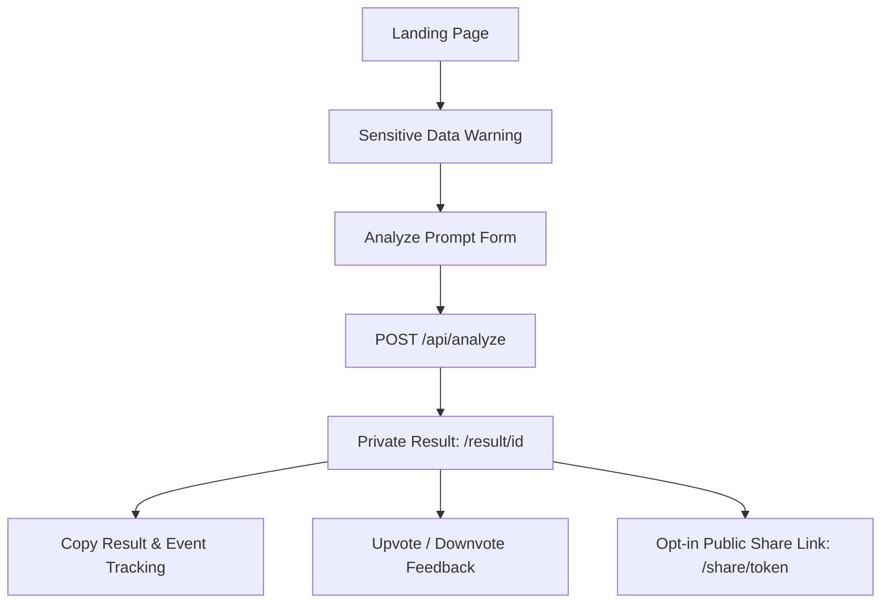

# Product MVP Specification — PromptPolish

PromptPolish is a highly polished, anonymous-first diagnostic and refinement utility for AI prompts. It is designed to evaluate raw prompts against standardized engineering criteria, provide concrete score breakdowns, highlight weaknesses, and deliver a polished, copy-ready version.

---

## 1. Core Product Workflow

The application runs a unified, distraction-free workflow with zero registration barrier:

---

## 2. In-Scope MVP Features

### 2.1 Landing Page & Navigation
*   A premium, visual-heavy interface that immediately hooks the user.
*   Clearly communicates the value proposition: moving from loose opinions to a concrete, reproducible **0-100 Prompt Score**.
*   A localized, easy-to-use toggle for Polish (PL) and English (EN) languages.
*   Drafts for `Privacy Policy` and `Terms of Service` accessible in the footer.

### 2.2 The `/analyze` Form & Safe Preflight
*   **Prompt Text Input**: A clean textarea optimized for pasting multi-line prompts.
*   **Working Language Toggle**: Polish (PL) or English (EN).
*   **Model Profile Selector**: Supporting only `general-llm` and `openrouter-deepseek-v4-flash`.
*   **Sensitive Data Preflight Warning**:
    *   A prominent disclaimer warning against pasting API keys, access tokens, customer names, passwords, and private data.
    *   Client-side pre-checks that look for structural markers of credentials (e.g., standard key prefixes, high entropy strings) before submission.
*   **Option Fields**: Inputs to optionally define custom prompt goals, target task types, output formats, and structural constraints.

### 2.3 The `/api/analyze` Pipeline
*   **Zod Request Validator**: Enforces strict schema rules on request headers, prompt text lengths, and choices.
*   **IP & Cookie Rate-Limiter**: Validates that the anonymous user hasn't exceeded the free daily analysis quota (e.g., 5 analyses per IP per day).
*   **Backend Sensitive-Data Detector**: Performs a deeper verification on the prompt content. Blocks any submission containing raw credentials or high-risk secrets. **Crucial rule**: Under no circumstance is a blocked prompt saved in the database or sent to the AI provider.
*   **Vercel AI SDK Structured Engine**: Prompts the OpenRouter model using the strict `Output.object` format to gather structured criterion scores and critiques.
*   **Semantic Scoring Calculation**: The final score is computed by a backend formula based on weighted criteria, preventing provider hallucinations or manipulation from skewing results.

### 2.4 Private `/result/[id]`
*   Shows a visual **0-100 Score Indicator** with custom grading levels (e.g., Weak, Good, Excellent).
*   **Criteria Breakdown Table**: Displays scores for specific vectors (e.g., Role clarity, Contextual depth, Constraint definition, Formatting instructions).
*   **Weakness Diagnosis & Improvement Plan**: Explains the top 3 weaknesses and how they are addressed.
*   **Copy-Ready Improved Prompt**: A beautiful, dedicated card displaying the optimized prompt, equipped with a one-click copy button.
*   **Copy Event Tracker**: Saves a telemetry log when the user copies the prompt to gauge product utility.
*   **Feedback Mechanism**: Upvote/downvote buttons to allow users to rate the quality of the generated prompt.

### 2.5 Opt-In `/share/[token]`
*   By default, prompt results are strictly private and linked to the creator's cookie-based `owner_anonymous_id`.
*   Users can click "Generate Share Link" to opt-in to public sharing.
*   Generates a non-predictable, highly random `share_token` URL.
*   Exposes only the prompt analysis, completely scrubbing any client identification metrics.
*   Sharing can be disabled at any time, instantly rendering the share URL 404.

---

## 3. Strict MVP Limits & Guardrails

*   **Prompt Length Limit**: Hard maximum of **4,000 characters** for pasted prompts in the MVP.
*   **Free Daily Limit**: A strict rate limit of **5 analyses per day per IP/Anonymous Session** to prevent high provider bills.
*   **No Raw Storage of Blocked Prompts**: Prompts flagged with sensitive data are immediately dropped and never persist in logs or databases.

---

## 4. Post-MVP Features (Strictly Out of Scope)

The following items represent **Paid SaaS Roadmap** vectors and are **strictly excluded** from the initial MVP:

| Feature Area | MVP Status (Anonymous Free) | Post-MVP Scope (Paid SaaS Gate) |
| :--- | :--- | :--- |
| **Authentication** | None (Session Cookies only) | User Registration, OAuth, profile management. |
| **Billing & Pricing** | Free (Zero payment pages) | Stripe subscriptions, tier quotas, team billing. |
| **Prompt Library** | None | Personal prompt repository, saved histories, search. |
| **Folders & Tags** | None | Organization structures, categorizing prompts. |
| **Marketplace** | None | Prompt sharing, buying, selling, public discovery. |
| **Multi-Model Execution** | 1 at a time (Profile select) | Multi-model comparative run, arena tests, side-by-side. |
| **Integrations** | None | Browser extensions, VS Code/Cursor IDE extensions. |
| **Collaboration** | None | Shared workspaces, team comments, shared editing. |
| **Benchmarking** | None | Performance metric dashboards, cost calculators. |
