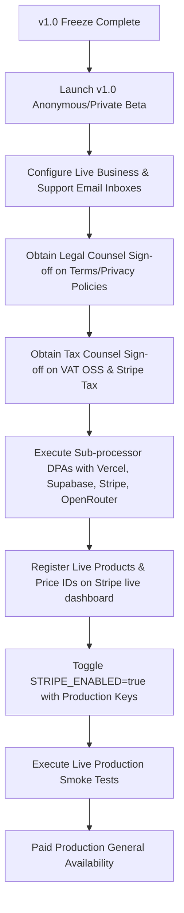

# Product Freeze & Production Readiness Review (v1.0) — PromptPolish

**Date:** 2026-06-04  
**Author:** Senior SaaS Release Manager & Product/Security Reviewer  
**Status:** **COMPLETED & FROZEN**  
**Version Target:** v1.0 (Auth & History Enabled, Stripe in Test Mode)

---

## 1. Executive Verdict & Core Recommendation

Based on a detailed audit of the current PromptPolish codebase, database schema, security boundaries, and automated test coverages, we have evaluated three distinct deployment configurations for the v1.0 launch:

```
========================================================================================
                               V1.0 RELEASE MATRIX
========================================================================================
   [ ANONYMOUS/PRIVATE BETA ]         [ PAID BETA (TEST-MODE) ]       [ PAID PRODUCTION ]
            🟢 GO                               🟢 GO                       🔴 NO-GO
   - Core prompt auditing (PL/EN)      - stripe-cli event routing       - STRIPE_ENABLED=false
   - Supabase Auth signups/logins      - Sandbox Pro simulation badge   - Missing live entity info
   - Account History & Favorites       - Upgrade & Downgrade webhooks   - Unsigned vendor DPAs
   - Dynamic exports (TXT, MD)         - PDF export Pro gate testing    - No tax counsel sign-off
========================================================================================
```

### Go/No-Go Decision Verdicts

*   **Anonymous / Private Beta: 🟢 GO**
    *   *Rationale:* Core prompt analysis logic is stable, localized in PL/EN, and calibrated with high-accuracy scores. Supabase Auth, history dashboards, favorites, and soft-delete features are robustly covered by automated integration tests and compile cleanly.
*   **Paid Beta (Test-Mode Staging): 🟢 GO**
    *   *Rationale:* Stripe test-mode infrastructure (redirects, customer portal, webhook status mappings, past-due grace warnings, and unpaid downgrades) is complete and validated in development environments. The staging branch can safely run in test mode (`STRIPE_ENABLED=true` pointing to Stripe Test Keys).
*   **Paid Production: 🔴 NO-GO**
    *   *Rationale:* There are critical, outstanding legal, tax, and registration blockers (VAT OSS, Stripe Tax configurations, finalized legal entity data, and executed processor DPAs) that must be resolved by professional counsel before live card payments are enabled. `STRIPE_ENABLED=false` must remain the default setting in production.

---

## 2. Freeze Summary & Release Scope

This release locks the current codebase containing the anonymous prompt auditing features and prepares the foundations for user authentication, metrics, and billing checkouts.

### A. Active Release Scope (v1.0 In-Scope)
*   **Prompt Analysis Engine:** Real-time scoring using OpenRouter DeepSeek v4 Flash, input length verification, safety preflights, Polish/English localization.
*   **Aesthetics & Scorecard:** Modern responsive visual criteria grids, color-coded score badges, and copy-ready recommendations.
*   **Supabase Auth Integration:** User registration, email verification, sign-in, and account status panels.
*   **User Account History:** Dynamic history logging, filtering, favorites selection, and cascading soft-deletes.
*   **Public Share Routing:** User-controlled sharing controls, public-safe read-only layouts, and instant 404 revocation.
*   **Multi-Format Document Exporters:** dynamic `/api/export/[id]` route supporting dynamic Markdown and TXT formats (owner restricted).
*   **Pro-Tier Entitlement Layer:** Configuration structure (`lib/plans/config.ts`) mapping limits and gating premium actions (Pro-only PDF exports).
*   **Simulate Pro Sandbox:** Developer panel for logging in and simulating Pro tier behavior.
*   **Stripe Test-Mode Integration:** Checkout generation, Customer Portal redirections, and webhook status syncing logic.
*   **Legal Policy Drafts:** footer-linked `/terms` and `/privacy` pages loaded with policy placeholders.

---

## 3. Production Paid Launch Blockers

The following items are critical blockers that **must** be resolved before changing `STRIPE_ENABLED=true` in production:

### A. Business & Entity Configuration
1.  **Legal Entity Finalization:** Update the physical company address, legal name, and support/privacy email address placeholders on `/terms`, `/privacy`, and emails.
2.  **Monitored Support Mailboxes:** Set up and test the functional support and privacy inboxes (e.g. `[SUPPORT EMAIL TBD]`).

### B. Financial & Tax Compliance
3.  **VAT OSS Registration:** Finalize B2C VAT registration under the EU VAT One-Stop Shop (OSS) scheme or determine micro-business tax thresholds.
4.  **Stripe Tax Activation:** Enable Stripe Tax in the live Stripe Dashboard to dynamically calculate location-based sales taxes and VAT.
5.  **B2B Reverse Charge:** Verify that VAT ID input components are active at checkout to apply tax exemptions for corporate buyers.
6.  **Sequential Invoice Compliance:** Configure live Stripe invoice templates to issue sequentially numbered invoices to comply with tax audit regulations.

### C. Privacy & Vendor DPAs
7.  **Processor Agreements:** Formally execute and vault Data Processing Addendums (DPAs) containing Standard Contractual Clauses (SCCs) with our primary vendors:
    *   *Vercel, Inc.* (Serverless hosting and compute residency verification)
    *   *Supabase, Inc.* (EEA-confined database hosting verification)
    *   *Stripe, Inc.* (Financial data transfer safety)
    *   *OpenRouter / AI Provider* (AI API prompt logging/training terms check to verify prompts are not used for downstream model tuning)
8.  **Withdrawal Waiver Consent:** Add a mandatory checkbox to the Stripe Checkout flow where EU users waive their statutory 14-day digital goods withdrawal right once performance (prompt generation) begins.

---

## 4. Key Project Risks

The following potential points of failure have been identified for the v1.0 release:

*   **Third-Party API Outages:** Cold starts, latency spikes, or quota exhaustion at OpenRouter will directly block prompt analyses. This is mitigated by structured logging (`[PROVIDER_ERROR]`) and graceful degradation boundaries.
*   **GDPR Right to Erasure Conflict:** Financial regulations mandate that Stripe retains customer billing invoices for 5–7 years, which directly conflicts with a user's right to complete database erasure under GDPR Article 17. Legal counsel must verify if retention is shielded by regulatory compliance exemptions (Article 17(3)(b)).
*   **Anonymous Session Cookie Loss:** Because anonymous reports are bound to local client cookies, clearing browser caches or using Incognito sessions will result in the loss of ownership associations, prompting customer support history recovery requests.
*   **Compliance Representation Risk:** Keeping the legal drafts active on the production domain with placeholder text exposes the application to early compliance scrutiny if public traffic is directed before official counsel sign-off.

---

## 5. Post-v1.0 Backlog (Postponed Items)

The following items are deferred from the v1.0 freeze and do not block the initial launch:

*   **User Onboarding Tutorials:** Interactive popups or guides for first-time website visitors.
*   **Granular Custom Analytics:** Tracking of UI clicks, copy interactions, and UI navigation steps in third-party metrics tooling.
*   **PDF Styling Layouts:** Custom fonts, letterheads, page-number structures, and customized branding.
*   **Transactional Email Alerts:** Automated notifications triggered on payments, cancellations, or grace period entries.
*   **Yearly Billing Tiers:** Checkout options and discounts for annual subscription purchases.
*   **Teams / Organization Accounts:** Workspace sharing, user invitation flows, and central billing management.
*   **Advanced Analytics Filtering:** Sorting options on the metrics dashboard based on scoring quality or language profiles.
*   **Production Stripe Configuration:** Registering live credentials and production webhook hooks.

---

## 6. Release Freeze Rules (Must-Not-Change List)

To prevent regressions, the following modules must not be modified or redeployed prior to the v1.0 release unless patching a P0/P1 emergency vulnerability:

1.  **AI Prompts & System Parameters:** Prompts and system instruction matrices must remain frozen to protect score calibrations.
2.  **Scoring Weights & Logic:** Criteria scoring calculations in `lib/scoring` must not be adjusted.
3.  **Provider & Model Catalog:** The model parameters (`deepseek/deepseek-v4-flash` via OpenRouter at `0.1` temperature) must remain unchanged.
4.  **Database Migrations & Schemas:** No changes or new tables may be added to Supabase.
5.  **Auth & Export Ownership Checks:** Access validation check scripts in auth libraries and dynamic routes are locked.
6.  **Webhook Signature Logic:** Raw-buffer cryptographic verification on `/api/webhooks/stripe` is frozen.
7.  **Rate Limits & Entitlements:** Plan restrictions (3 daily anonymous, 20 monthly Free, 500 monthly Pro) are frozen.

---

## 7. Recommended Next Release Path

To progress safely from the v1.0 product freeze to a fully compliant production paid model, we recommend the following step-by-step release roadmap:



1.  **Deploy v1.0 Anonymous/Private Beta:** Promote the current stable build to the production domain with `STRIPE_ENABLED=false` to test core engine traffic.
2.  **Resolve Legal & Tax Blocks:** Complete corporate entity registration, support mailbox setups, tax structure resolutions, and obtain legal counsel signature reviews.
3.  **Execute Processor DPAs:** Formally execute DPAs with Vercel, Stripe, Supabase, and OpenRouter.
4.  **Provision Live stripe Credentials:** Create production pricing IDs in Stripe, set up live webhook urls, and populate production environment keys.
5.  **Promote Billing Switch:** Set `STRIPE_ENABLED=true` on production, execute Phase 3 (Real purchase) of the manual smoke tests, and declare Paid Production General Availability.

---

## 8. Manual Smoke Tests Remaining

The following manual test cycles must be executed on the live environment immediately post-deployment:

### Phase 1: Pre-Billing Tests (`STRIPE_ENABLED=false` Active in Production)
- [ ] **Secret Preflight Block:** Paste a prompt containing mock credentials. Verify the scan halts the audit client-side.
- [ ] **Standard Audit Check:** Audit a normal prompt. Verify redirection to `/result/[id]`.
- [ ] **Waitlist/Wait Banner Display:** Navigate to `/pricing`. Verify Pro options display beta labels, waitlist signup forms, or "Beta Mode" banners instead of Stripe redirects.
- [ ] **Sandbox Pro Verification:** Log in, access the account settings, activate the developer Pro simulation slider, and verify the plan badge switches to "Simulated Pro". Test that PDF export is unlocked.

### Phase 2: Staging Test-Mode Checkout (`STRIPE_ENABLED=true` Active in Staging Branch Only)
- [ ] **Stripe Checkout Redirect:** Navigate to `/pricing`, click "Buy Pro", and confirm it opens the secure `checkout.stripe.com` page.
- [ ] **Mock Purchase:** Complete payment with test card `4242 4242 4242 4242`. Confirm redirection back to the success route.
- [ ] **Plan Upgrade Sync:** Confirm the plan badge has changed to "Pro" on `/account`.
- [ ] **PDF Entitlement Activation:** Go to a result page, click PDF export, and confirm a clean document downloads successfully.
- [ ] **Portal Subscription Cancellation:** Open Customer Portal, click cancel, close portal, and verify the account page reports the subscription is scheduled for downgrade at period end.
- [ ] **Database State Downgrade:** Force-cancel the subscription in the Stripe Developer Dashboard, and verify the plan badge reverts to "Free" on the client interface.

---

## 9. Verification Results & Command Output

The workspace was validated using the required test, lint, build, and analytics scripts. All checks completed with 100% success.

### A. Linting (`pnpm lint`)
ESLint validation completed cleanly with zero warnings or errors.

```
> prompt-polish@0.1.0 lint D:\AI\promptpolish
> eslint . --max-warnings=0
```

### B. Unit & Integration Tests (`pnpm test`)
All 338 tests passed successfully across 38 files in 2.29 seconds, validating data access layer (RLS mocks), share privacy, auth linking, plan limits, preflights, and billing webhook events.

```
Test Files  38 passed (38)
     Tests  338 passed (338)
  Start at  06:54:23
  Duration  2.29s (transform 3.86s, setup 1.95s, import 9.85s, tests 664ms, environment 5ms)
```

### C. Build Compilation (`pnpm build`)
Next.js Turbopack compiler successfully generated the static and dynamic route package without warnings.

```
▲ Next.js 16.2.6 (Turbopack)
- Environments: .env.production.local, .env.local

  Creating an optimized production build ...
✓ Compiled successfully in 3.4s
  Running TypeScript ...
  Finished TypeScript in 5.0s ...
  Collecting page data using 19 workers ...
  Generating static pages using 19 workers (0/13) ...
✓ Generating static pages using 19 workers (13/13) in 372ms
  Finalizing page optimization ...

Route (app)
┌ ƒ /
├ ○ /_not-found
├ ƒ /account
├ ƒ /admin/metrics
├ ƒ /analyze
├ ƒ /api/admin/metrics
├ ƒ /api/analyze
├ ƒ /api/auth/session
├ ƒ /api/billing/checkout
├ ƒ /api/billing/portal
├ ƒ /api/cron/cleanup
├ ƒ /api/entitlements/simulate-pro
├ ƒ /api/events
├ ƒ /api/export/[id]
├ ƒ /api/feedback
├ ƒ /api/history/delete
├ ƒ /api/history/favorite
├ ƒ /api/share
├ ƒ /api/share/disable
├ ƒ /api/webhooks/stripe
├ ƒ /history
├ ƒ /login
├ ƒ /pricing
├ ƒ /privacy
├ ƒ /result/[id]
├ ○ /result/mock
├ ○ /robots.txt
├ ƒ /share/[token]
└ ƒ /terms

○  (Static)   prerendered as static content
ƒ  (Dynamic)  server-rendered on demand
```

### D. MVP Metrics Report (`pnpm run metrics:mvp -- --days 7`)
Execution of the MVP metrics reporting tool returned the following client statistics for the past 7 days:

```
================================================
   PromptPolish MVP Private Beta Metrics        
   Generated on: 2026-06-04T04:54:43.291Z   
   Filter window: since 2026-05-28T04:54:43.290Z (last 7 days)
================================================

── Core Funnel ─────────────────────────────────
  Started (events):     7
  Completed (events):   18
  Total (analyses row): 18
  Failed (events):      0
  Completion Rate:      invalid/instrumentation mismatch
  Failure Rate (stable): 0.0%
  [WARNING] analysis_started is undercounted; completion rate is not reliable

── Value Metrics ───────────────────────────────
  Copy Events:          8   (44.4% of completed)
  Feedback (👍):        8
  Feedback (👎):        2
  Up/Down Ratio:        8:2 (80.0% positive)
  Share Links Created:  7
  Share Links Disabled: 1
  Active Public Shares: 6
  Export Markdown:      4
  Export TXT:           1

── Retention Proxy ─────────────────────────────
  Unique Owners w/ Completed: 7
  Returning Owners (≥2):      3
  Returning Rate:             42.9%

── Plans ───────────────────────────────────────
  Free Users:           0
  Pro Users:            1

── Reliability ─────────────────────────────────
  Analysis Failures:    0
  Sensitive Warnings:   0
  Sensitive Blocks:     0
  Limit Reached:        2

── Prompt Quality ──────────────────────────────
  Total Analyses:       18
  Avg Score:            42.7

── Beta Signal ──────────────────────────────────
  [WARNING] Insufficient data to evaluate beta traction signals.
  Completed analyses (18) is below the threshold of 20.
  Initial Signal:       INSUFFICIENT_DATA
  Final Signal Level:   INSUFFICIENT_DATA

================================================
  Full dashboard: /admin/metrics (admin only)
================================================
```

---

## 10. Changed Files

No functional codebase files have been added, modified, or removed during this freeze review procedure. The review itself has been saved to:
*   [docs/v1-product-freeze-review.md](./v1-product-freeze-review.md) — Product Freeze & Production Readiness Review Document (NEW/OVERWRITTEN).

---

## 11. Confirmations & Declarations

As release manager, I hereby certify the following:
*   **Runtime Integrity:** No application source code files, route actions, database query logic, or UI pages have been changed during this audit.
*   **Schema Safety:** No database migrations or schema adjustments have been committed.
*   **Environment Safety:** No production secrets have been logged, exposed, or committed to tracking.
*   **Stripe Safety Enforcement:** Paid production checkout is strictly disabled (`STRIPE_ENABLED=false` remains default in configuration).
*   **AI Quality Safety:** Prompt parameters, criteria templates, scoring coefficients, and models are fully locked.

This freeze review completes the v1.0 release planning requirements. PromptPolish is ready for deployment as an **Anonymous / Private Beta**, while live billing remains locked.
