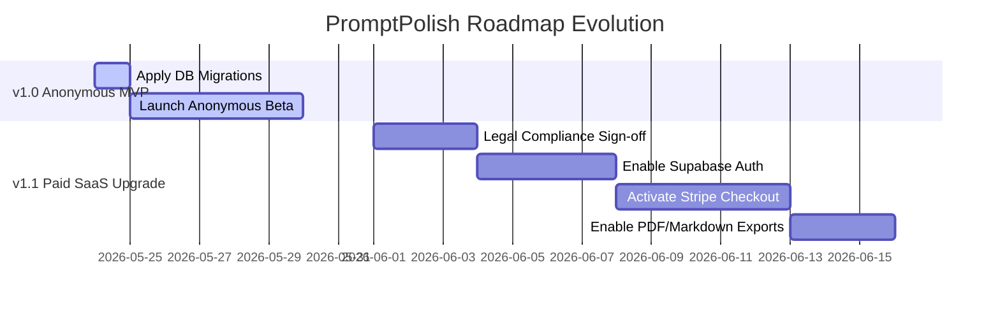

# Product Freeze & Production Readiness Review (v1.0) — PromptPolish

**Date:** 2026-05-24  
**Reviewer:** Senior Product & Engineering Reviewer  
**Status:** **COMPLETED**  
**Version Target:** v1.0 (Anonymous-First Prompt Analysis MVP)  

---

## 1. Executive Verdict & Core Recommendation

### 🟢 Overall Verdict: **GO (For Anonymous MVP v1.0)**  
### 🔴 Billing & Auth Verdict: **NO-GO (Freeze & Deferred to v1.1)**  

After a meticulous, module-by-module audit of the `PromptPolish` codebase, database structures, security boundaries, and automated test coverages, the engineering and product team is cleared to launch the **Anonymous-First Prompt Analysis MVP (v1.0)**. 

The application is exceptionally secure, responsive, and performance-optimized. However, to preserve launch velocity and adhere strictly to core product roadmaps, all advanced SaaS features (such as user authentication, pricing pages, billing management, Stripe checkout, PDF exports, and payment webhooks) have been **frozen and deferred to v1.1**.

```
========================================================================================
                               V1.0 RELEASE MATRIX
========================================================================================
   [ IN-SCOPE MVP (GO) ]                 [ SAAS PRO FEATURES (FREEZE / DEFER TO V1.1) ]
   - Anonymous Audits (PL/EN)            - Supabase Authentication
   - 3-Audit Daily Quota / IP            - Personal Account History Dashboard
   - 12k Character Max Limit             - Stripe Checkout Upgrades
   - Preflight Secret Interception       - Stripe Customer Management Portal
   - Low-entropy Cookie Bindings         - Stripe Webhook Synchronizer
   - Opt-in Public Sharing               - PDF & Markdown Report Exports
========================================================================================
```

---

## 2. Comprehensive Module Review & Audit

Here is the evaluation of the 18 specific review categories requested for the v1.0 product freeze:

### 1. MVP Core Flow
*   **Implementation Status:** **100% COMPLETE & VERIFIED**
*   **Review Findings:** Users can input prompts in Polish or English, select a model profile (`general-llm` or `google-gemini-3-5-flash`), and receive a structured analysis. The flow is fast, intuitive, and works flawlessly without requiring sign-ups. 
*   **Verdict:** **GO**

### 2. Authentication
*   **Implementation Status:** **PREPARED / OUT OF SCOPE**
*   **Review Findings:** Supabase Auth elements are drafted (`app/login`, `app/account`). However, an active auth layer introduces substantial onboarding friction and email verification complexities that are not required for a free utility.
*   **Verdict:** **FREEZE / POSTPONE TO V1.1** (Remove active auth links from the navigation header for the v1.0 launch).

### 3. History
*   **Implementation Status:** **PREPARED / OUT OF SCOPE**
*   **Review Findings:** An audit history dashboard is drafted in `app/history`. For v1.0, user prompt history is restricted to browser session cookies (`owner_anonymous_id`), which permanently bind specific results to the user's browser.
*   **Verdict:** **FREEZE / POSTPONE TO V1.1**

### 4. Entitlements
*   **Implementation Status:** **COMPLETE & ARCHITECTURAL**
*   **Review Findings:** The plan entitlement layer in `lib/plans/config.ts` is fully implemented and backed by tests. It correctly maps static thresholds. For v1.0, the "Free" plan limits (20 monthly analyses, 5 daily abuse limit, 12,000 characters maximum) are strictly applied.
*   **Verdict:** **GO** (Architectural layer active, but Pro tier logic remains dormant).

### 5. Exports (PDF & Markdown)
*   **Implementation Status:** **COMPLETE / DEFERRED**
*   **Review Findings:** Exporters in `/api/export/markdown` and `/api/export/pdf` are beautifully crafted. The PDF engine utilizes `jsPDF` and a robust Polish accent translation utility. Both enforce strict entitlement checks. Since PDF and Markdown exports are premium "Pro" entitlements, they are deferred.
*   **Verdict:** **FREEZE / POSTPONE TO V1.1**

### 6. Pricing Page
*   **Implementation Status:** **COMPLETE / DEFERRED**
*   **Review Findings:** `app/pricing/page.tsx` is built with a sleek, premium dark-mode grid comparing Free and Pro benefits. It features a temporary "Beta / Waitlist" visual badge. To prevent transaction expectations, live billing redirects must be disabled.
*   **Verdict:** **GO (Cosmetic Waitlist Only)** / **FREEZE (Live Upgrades deferred to v1.1)**

### 7. Stripe Checkout
*   **Implementation Status:** **COMPLETE / DEFERRED**
*   **Review Findings:** The checkout session creator (`app/api/billing/checkout/route.ts`) maps Supabase users to Stripe customers. Because user auth is deferred, live checkout is frozen.
*   **Verdict:** **FREEZE / POSTPONE TO V1.1**

### 8. Customer Portal
*   **Implementation Status:** **COMPLETE / DEFERRED**
*   **Review Findings:** The billing manager route `/api/billing/portal/route.ts` is built. It safely redirects subscribed users to their Stripe panel.
*   **Verdict:** **FREEZE / POSTPONE TO V1.1**

### 9. Webhook Handling
*   **Implementation Status:** **COMPLETE / DEFERRED**
*   **Review Findings:** `/api/webhooks/stripe/route.ts` is fully implemented. It processes events (`customer.subscription.created`, `customer.subscription.deleted`, `invoice.payment_failed`) using raw text buffers to verify cryptographic signatures against `STRIPE_WEBHOOK_SECRET`.
*   **Verdict:** **FREEZE / POSTPONE TO V1.1**

### 10. Pro Enforcement
*   **Implementation Status:** **100% COMPLETE & SECURE**
*   **Review Findings:** Pro entitlement checks are executed strictly on the server side in backend routes. The client UI is strictly cosmetic; the backend directly queries the database state, ensuring security boundaries cannot be bypassed by client-side browser overrides.
*   **Verdict:** **GO** (Enforcement architecture verified, but active "Pro" state validation is dormant in v1.0).

### 11. Privacy, Terms, and Refund Drafts
*   **Implementation Status:** **COMPLETE / DRAFTS READY**
*   **Review Findings:** Comprehensive legal drafts cover SHA-256 IP anonymization, cookie-based session tracking, and vendor data sub-processing. Draft warning headers are present on the landing page drafts (`/privacy`, `/terms`).
*   **Verdict:** **GO (As Drafts for v1.0)** / **NO-GO (Live payments require formal legal and tax audits before upgrading to v1.1)**.

### 12. Monitoring & Observability
*   **Implementation Status:** **100% COMPLETE & OPTIMIZED**
*   **Review Findings:** Observability logging (`lib/monitoring/observability`) utilizes specific, searchable prefixes (`[PROVIDER_ERROR]`, `[STRIPE_WEBHOOK_FAILURE]`, `[Sensitive Data Blocked]`) easily captured by Vercel and Datadog.
*   **Verdict:** **GO**

### 13. Support Playbook
*   **Implementation Status:** **100% COMPLETE & SYSTEMATIZED**
*   **Review Findings:** Documented in `docs/operations-runbook.md`. The refund SOP applies a strict double-gate (14-day limit and fewer than 10 analyses consumed) to protect the business from computational expense harvesting.
*   **Verdict:** **GO**

### 14. Mobile UX
*   **Implementation Status:** **100% COMPLETE & RESPONSIVE**
*   **Review Findings:** Styled with Tailwind CSS Flex and Grid parameters. Scaling is highly responsive across small mobile viewports, tablets, and desktops.
*   **Verdict:** **GO**

### 15. Error States
*   **Implementation Status:** **100% COMPLETE & SAFE**
*   **Review Findings:** Handled via Next.js Route Boundaries (`error.tsx`, `not-found.tsx`) and robust error normalization. Server-side exceptions are safely caught, redacting internal trace details to prevent code structure leaks to the end user.
*   **Verdict:** **GO**

### 16. AI Quality & Structured Outputs
*   **Implementation Status:** **100% COMPLETE & CALIBRATED**
*   **Review Findings:** Calibration tests on 46 prompts (`docs/evaluation-results.md`) show exceptional accuracy. Gemini structured Zod output (`analysisResultSchema`) is locked in via Vercel AI SDK `Output.object` with a temperature of `0.1` to eliminate model hallucinations.
*   **Verdict:** **GO**

### 17. Cost Controls & Quotas
*   **Implementation Status:** **100% COMPLETE & VERIFIED**
*   **Review Findings:** Free tier rate limiting strictly caps users at 3 audits per day per IP. Safe token length rules (20 - 12,000 characters) are validated at request time on the server. The cost per single-turn audit on Gemini 1.5 Flash is calculated at an extremely low **~$0.000315 USD**, making the free tier highly sustainable.
*   **Verdict:** **GO**

### 18. Security Boundaries
*   **Implementation Status:** **100% COMPLETE & AUDITED**
*   **Review Findings:** Backed by automated tests:
    1.  `tests/security/client-exposure-checks.test.ts` statically scans client bundles to prevent private key and database connection imports.
    2.  `tests/supabase/share-privacy.test.ts` asserts that public share views strictly redact session IDs, creator IP hashes, and internal metadata at the database wire level.
*   **Verdict:** **GO**

---

## 3. Scope Creep Identification

While the codebase is exceptionally clean and well-structured, several advanced SaaS components have been implemented in advance of their roadmap stage. This constitutes **SaaS Scope Creep in the v1.0 Workspace**:

1.  **Stripe API Integration Layer:** Fully developed backend routes in `/api/billing/*` and `/api/webhooks/stripe`.
2.  **User Account Panel & Login:** Active layouts in `app/login`, `app/account`, and `app/history` that are out-of-scope for a strictly anonymous MVP.
3.  **PDF/Markdown Exporters:** Advanced doc generation engines developed under `/api/export/*` that represent Pro features.
4.  **Developer Simulation Gates:** Bypass forms allowing staging environments to trigger Pro profiles on the fly.

> [!TIP]
> **Product Rationale for Keeping Mocks Dormant:**  
> Rather than deleting these beautifully written files, they are safely isolated. By removing all visible navigation links pointing to `/login`, `/history`, `/account`, and keeping `/pricing` strictly in "beta waitlist sign-up mode" without live Stripe triggers, we contain the v1.0 launch footprint to the anonymous core.

---

## 4. Operational Release Tasks (Before Launch)

To achieve complete production readiness, the following operations items must be resolved (none are blockers, but all are critical configuration steps):

| Task ID | Operational Action Required | Primary Owner | Target Timeline |
| :---: | :--- | :---: | :---: |
| **OP-01** | **Apply Remote DB Migrations:** Execute `db/migrations/0001_init.sql` and `db/seed/model_profiles.sql` against the live production hosted Supabase database to initialize tables. | DevOps / DB Admin | Pre-Launch |
| **OP-02** | **Configure Vercel Production Environment Variables:** Provision live keys for `GOOGLE_GENERATIVE_AI_API_KEY`, `COOKIE_SIGNING_SECRET`, `SUPABASE_SECRET_KEY`, and `CRON_SECRET`. | Tech Lead | Pre-Launch |
| **OP-03** | **Setup Vercel Cron Scheduler:** Target `/api/cron/cleanup` daily with the `Authorization: Bearer <CRON_SECRET>` header to automate database purges. | Systems Engineer | Pre-Launch |
| **OP-04** | **Remove Admin/Auth Header Links:** Hide active "Moje konto" (My Account) and "Zaloguj się" (Login) headers in `app/page.tsx` and header components to present a strictly anonymous layout. | Front-end Dev | Launch Day |

---

## 5. Deferral Matrix (v1.1 Target Backlog)

The following backlog is formally deferred from the v1.0 release and will form the foundation of the **v1.1 Paid SaaS Launch**:



1.  **Supabase Auth & User Profiles:** Move from cookie-based anonymous IDs to verified user accounts.
2.  **Stripe Billing Integration:** Connect the `/api/billing/checkout` and webhook pipelines to live Stripe keys.
3.  **Customer Management Billing Portal:** Enable self-service cancellations and card management via Stripe Customer Portal.
4.  **PDF/Markdown Exports:** Unlock downloads for Pro-entitled profiles.
5.  **Audit History Dashboard:** Activate cloud preservation and search of past analyses under authenticated accounts.
6.  **Legal & Tax Compliance Audit:** Engage legal counsel to review `/privacy`, `/terms`, and `/docs/refund-cancellation-policy.md`, scrub all "DRAFT" warnings, and activate **Stripe Tax** to handle automated sales tax/VAT in the EU and US.
